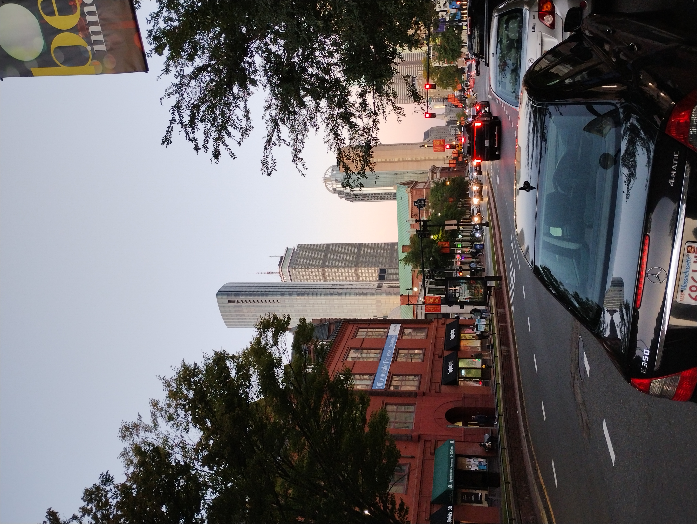
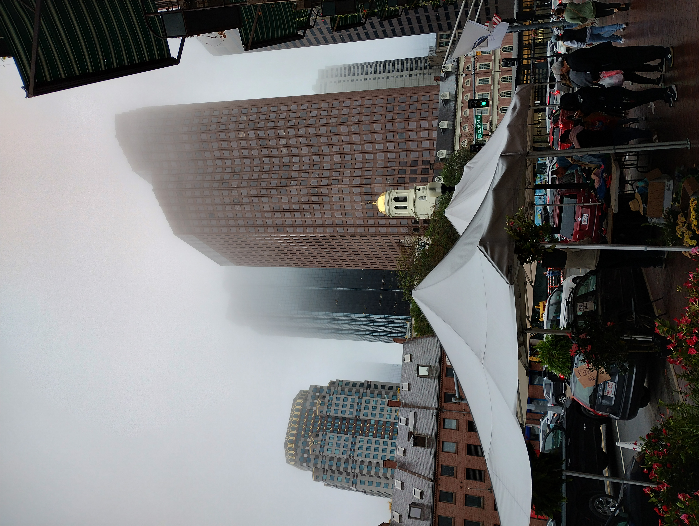
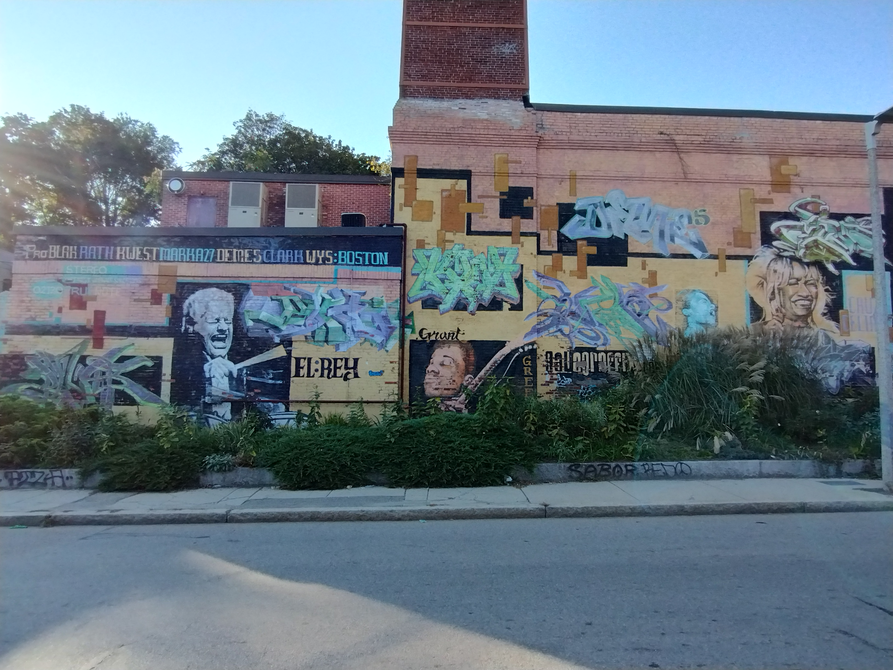
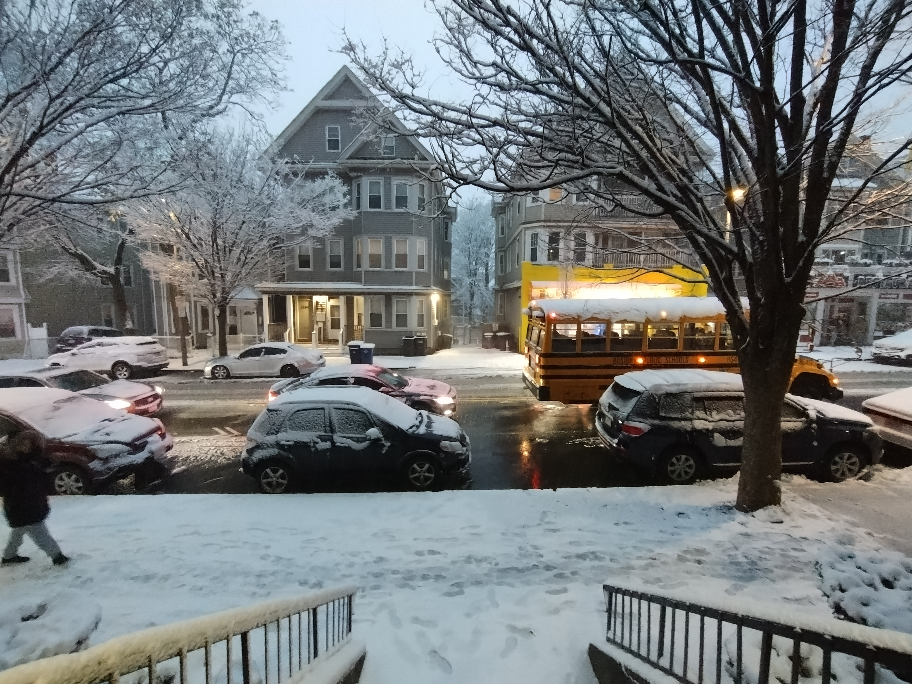
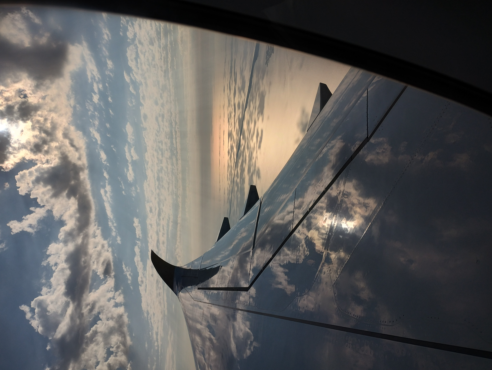
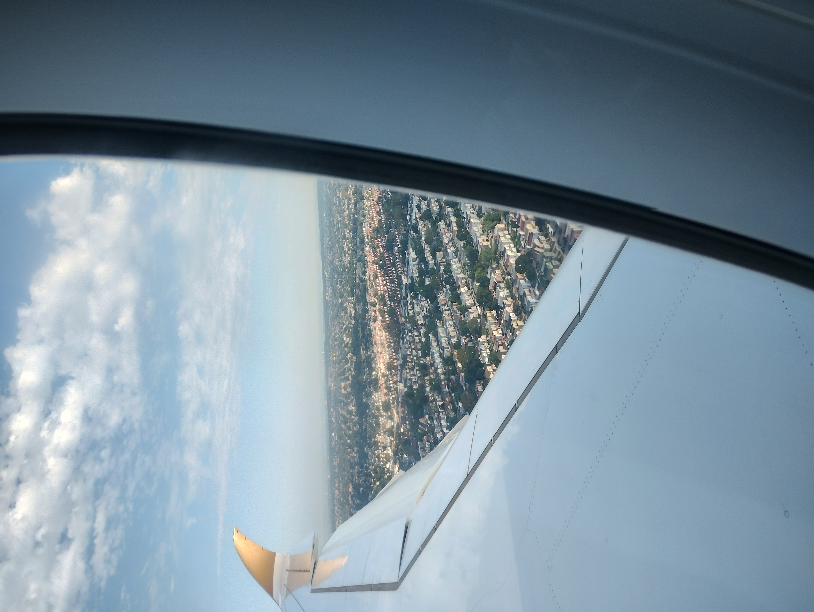
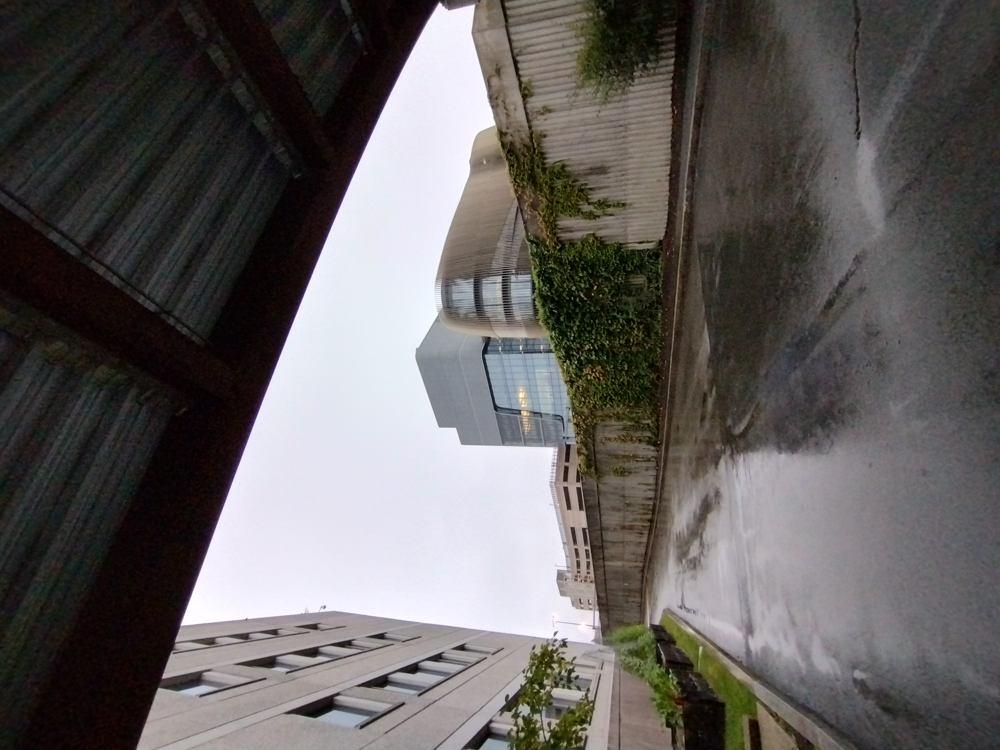
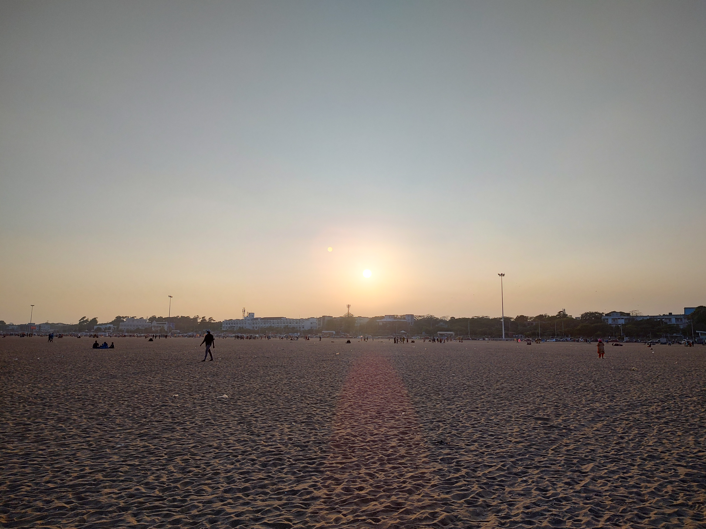
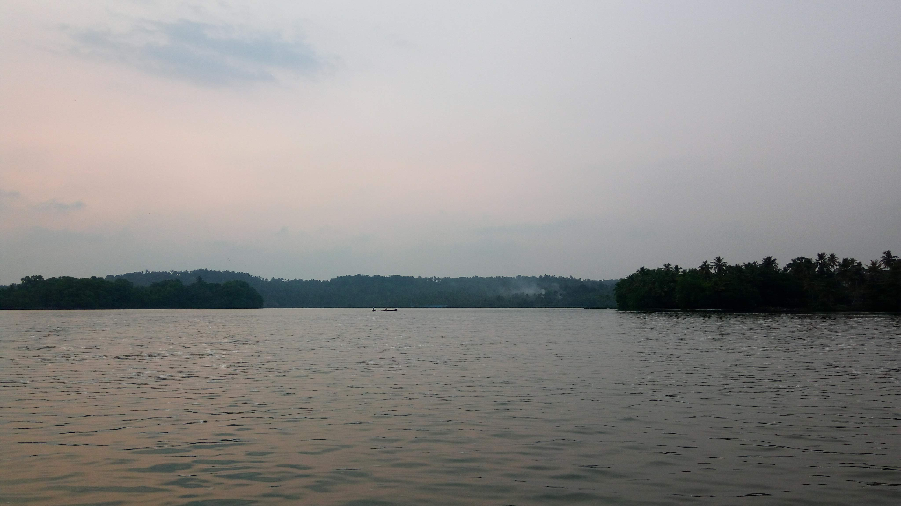

### The world through my eyes

*Every photograph tells a unique story of discovery, wonder, and connection.*

#### Musuem of Fine Arts, Boston 🏛️

    

        

            
        

        <!-- 
The Prudential Building, viewed from Huntington Avenue.
 -->
    

    
    <!-- 

        

            
        

        
The Boston Skyline, as viewed from The Longfellow Bridge

    

    
    

        

            
        

        
An iconic symbol of engineering and beauty, shrouded in morning fog

    

    

        

            
        

        
An iconic symbol of engineering and beauty, shrouded in morning fog

    
 -->

    

        

            
        

        <!-- 
An iconic symbol of engineering and beauty, shrouded in morning fog
 -->
    

    <!-- 

        

            
        

        
An iconic symbol of engineering and beauty, shrouded in morning fog

    
 -->

    

        

            
        

        <!-- 
An iconic symbol of engineering and beauty, shrouded in morning fog
 -->
    

#### Boston, USA 🏙️

    

        

            
        

        
The Prudential Building, viewed from Huntington Avenue.

    

    
    

        

            
        

        
The Boston Skyline, as viewed from The Longfellow Bridge

    

    
    

        

            
        

        
A misty morning in downtown Boston during the Farmer's Market.

    

    

        

            
        

        
Mystic Generating Station near Assembly in Boston, showcasing its iconic smokestacks and wind turbine under a picturesque sky.

    

    

        

            
        

        
A glimpse of Downtown Boston.

    

    

        

            
        

        
Artwork murals painted on the walls of a houses in Mission Main, Boston.

    

    

        

            
        

        
Murals adorning the walls of a house in Centre Street, Boston.

    

    

        

            
        

        
Trinity Church in Copley Square, Boston, seen from Clarendon Street.

    

    

        

            
        

        
A snowy day along Washington Street.

    

#### New York City, USA 🗽

    

        

            
        

        
Soaring above the waters of New York City.

    

    
    

        

            
        

        
The suburbs of NYC, as viewed from an Etihad Airbus.

    

#### Northeastern University 🎓

    

        

            
        

        <!-- 
An iconic symbol of engineering and beauty, shrouded in morning fog
 -->
    

    
    

        

            
        

        <!-- 
An iconic symbol of engineering and beauty, shrouded in morning fog
 -->
    

#### Indian Institute of Technology, Madras 🎓

    

        

            
        

        
IIT-Madras Research Park building, captured in a photograph.

    

    
    <!-- 

        

            
        

        
Another perspective on the IIT-Madras Research Park's striking architecture.

    
 -->

    

        

            
        

        
A view of the Mechanical Sciences Block at IIT Madras.

    

#### Incredible India 🇮🇳

    

        

            
        

        
A tranquil dawn at Marina Beach.

    

    
    

        

            
        

        
A serene lake in Trivandrum, Kerala, with a lone fisherman silhouetted in the distance.

    

<!-- Modal -->

    &times;
    

<!-- JavaScript for modal functionality -->
